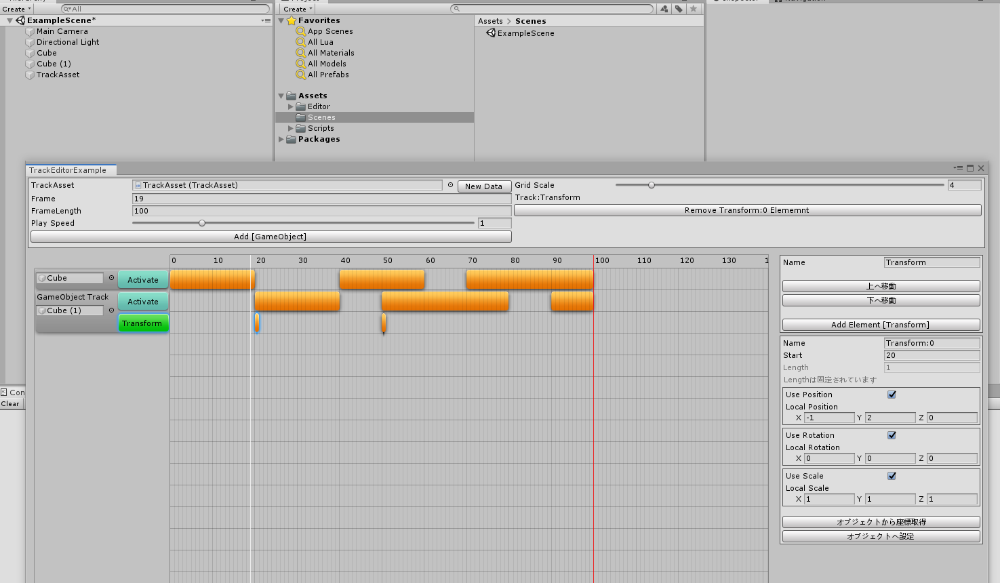

# TrackEditor

エディタ拡張でTimeline的なトラック編集を行うためのフレームワークです。

要素(TrackData,TrackElement)を定義することで、GUIで編集し、アセットを出力(TrackAsset)することが出来ます。

サンプルではGameObjectにTrackAssetを保存し、再生時にTrackAssetPlayerで再生が可能です。

定義の追加は簡単なものでも数箇所の書き換えが必要ですが、基本的にはコピペして修正で済む形になっています。

## 要素の追加方法

TrackDrawerとTracksのソースをコピーしてエディター用とランタイム用のソースを作成し、それらを各所に登録することで使用できるようになります。

各所への登録は本来煩雑な部分ですが、Generate.csに定義を追加して実行することでコードが生成されます。

